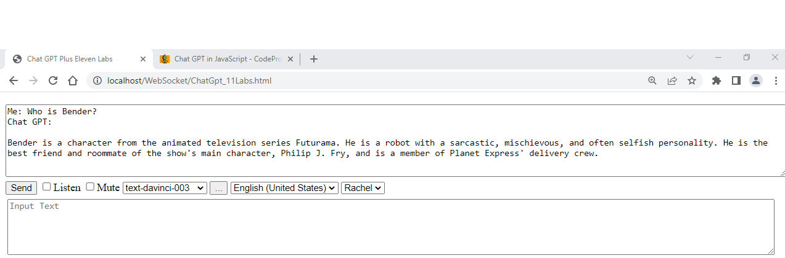

# Chat GPT plus Eleven Labs in JavaScript

Web app to talk to Chat GPT using Eleven Labs text-to-speech

https://www.codeproject.com/Articles/5357186/Chat-GPT-plus-Eleven-Labs-in-JavaScript

## Introduction
This application is my attempt to create a client app to talk to Chat GPT in JavaScript. My goal is to demonstrate how to use Chat GPT API with speech-to-text and Eleven Labs text-to-speech capabilities. 
This means that you can talk to your browser and your browser will talk back to you with a human like voice.

## Background
This article is a sequel to my previous article Chat GPT in JavaScript.

## Using the Code
1. Get OPENAI_API_KEY from https://beta.openai.com/account/api-keys.
3. Open ChatGPT_11Labs.js and add the API Key key to the first line.
4. Get ELEVEN_LABS_API_KEY from https://beta.elevenlabs.io/speech-synthesis > Profile > API Key.
4. Open ChatGPT_11Labs.js and add the API Key key to the second line.
   
Here is the code. Basically, it uses XMLHttpRequest to post JSON to OpenAI's endpoint and then posts the answer from Chat GPT to Eleven Labs endpoint.

## Points of Interest
Not all browsers support speech-to-text. Chrome and Edge seem to support it while Firefox does not. This is why the Listen checkbox will be hidden in Firefox.
